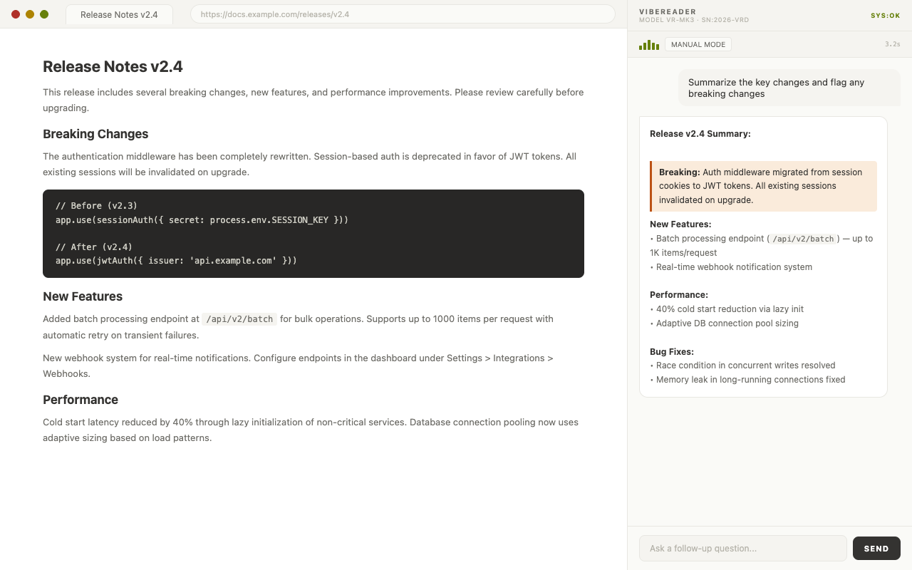
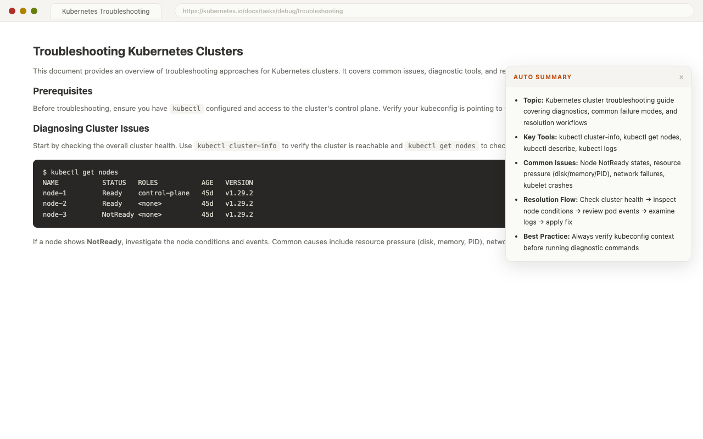
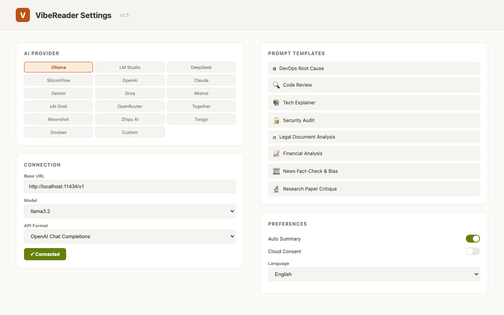

# VibeReader — AI 网页阅读器、摘要与分析助手（Chrome 浏览器扩展）

> **用 AI 阅读任意网页。** 一款 Chrome 浏览器扩展，支持一键页面摘要、深度内容分析、智能分段处理 — 内置 31 个 AI 服务商，支持本地大模型，中/英/日三语界面。

**[Chrome 应用商店](https://chrome.google.com/webstore)** | **[隐私政策](PRIVACY.md)** | **[English](README.md)**



---

## VibeReader 是什么？

VibeReader 是一款 **Chrome 浏览器扩展**，将浏览器变为 **AI 驱动的阅读助手**。它自动提取网页可见内容，发送给大语言模型进行分析 — 帮你在几秒内理解原本需要几分钟才能读完的长页面。

与需要手动复制粘贴的通用 AI 聊天工具不同，VibeReader **就地工作**：在任意页面打开侧边栏，提出问题，即可获得基于完整页面上下文的 AI 分析 — 无需切换标签页，无需粘贴。

### 核心功能

- **AI 网页自动摘要** — 每次加载页面时自动生成要点摘要（中/英/日）
- **对任意网页提问** — 像查询文档一样查询当前页面：*"有哪些破坏性变更？"*、*"总结这份缺陷报告"*
- **多标签页 AI 分析** — 通过浮窗标签选择器一次加载多个标签页内容，合并后统一分析
- **智能内容分段** — 页面内容超出模型上下文？VibeReader 自动分割、逐段分析、合并结果 — 无需手动干预
- **15 个专业提示词模板** — DevOps 根因分析、代码审查、安全审计、法律文书分析、财务分析、新闻事实核查等 — 均支持中/英/日
- **31 个 AI 服务商** — Ollama、LM Studio、DeepSeek、硅基流动、Moonshot、智谱、通义、豆包、OpenAI、Claude、Gemini、Groq、Mistral、xAI 等 — 还支持任意自定义端点
- **本地大模型优先** — 使用 Ollama 或 LM Studio 在本地运行，数据完全不出设备
- **零构建步骤** — 纯原生 JS，无需 npm，无需打包工具。直接加载即可使用

---

## 功能详解

| 功能 | 工作方式 |
|---|---|
| **一键页面分析** | 提取可见文本、meta 标签、标题和 URL；过滤广告/脚本/样式。支持用户选中文本。 |
| **多标签页上下文** | [+ 添加页面] 打开浮窗标签选择器 — 选择多个标签页，内容并行提取后合并，以 `══════ 第 N/M 页 ══════` 分隔。 |
| **自动摘要侧边栏** | 每次加载新页面时注入可折叠侧边栏，显示本地化摘要 — 展开阅读，折叠隐藏。失败时显示重试按钮。 |
| **RAW_TXT 编辑器** | 可编辑的页面上下文面板，支持语法高亮、位置标记（10k/20k/...）、文本搜索（上一个/下一个导航）及实时统计（行数 + Token 估算）。 |
| **二分分段策略** | 自动在自然段落/句子边界处分段（2→4→8→16 段），逐段分析后合成统一回答。可视化进度条显示每段耗时和预估剩余时间。 |
| **15 个提示词模板** | 涵盖技术、法律、金融、新闻、研究、写作、产品、数据等专业预设 — 用户可在设置中创建自定义模板。 |
| **多轮对话上下文** | 每次追问自动携带上一轮 AI 回复，支持更深入的对话式分析。 |
| **4 种 API 格式** | OpenAI Chat Completions、Anthropic Messages、OpenAI Responses API、Azure OpenAI — 按服务商自动路由。 |

---

## 安装方法

### 前置条件

- Google Chrome（或任何支持 Manifest V3 的 Chromium 浏览器）
- 一个 AI 后端（本地或云端）：
  - **Ollama（本地）** — 无需 API Key。从 [ollama.com](https://ollama.com) 安装后运行 `ollama serve`
  - **LM Studio（本地）** — 无需 API Key。在 LM Studio 中下载模型，然后启动服务
  - **云端** — 从任意支持的服务商获取 API Key（DeepSeek、硅基流动、OpenAI、Anthropic、Google AI Studio 等）

### 步骤

1. **下载 / 克隆** 本仓库到本地。

2. **加载为未打包的扩展**
   - 打开 `chrome://extensions/`
   - 启用 **开发者模式**（右上角开关）
   - 点击 **加载已解压的扩展程序** → 选择项目文件夹

3. **配置 AI 设置**
   - 点击扩展图标 → 右键 → **选项**
   - 选择 **服务商**（本地或云端）
   - Base URL 和模型会按服务商自动填充；如需要请输入 **API Key**
   - 如使用自定义端点，选择 **API 格式**（OpenAI / Anthropic / Responses）
   - 点击 **测试连接** 验证
   - （可选）启用 **自动摘要**
   - （可选）添加自定义 **提示词模板**
   - （可选）编辑 **默认系统提示词**

4. **固定扩展** 到工具栏以便快速访问。

### 说明

- 无需 `npm install` 或构建步骤 — 纯原生 JavaScript。
- 所有设置通过 `chrome.storage.sync` 跨 Chrome 配置文件同步。

---

## 支持的 AI 服务商

| 类别 | 服务商 |
|---|---|
| **本地大模型** | Ollama、LM Studio |
| **国内云服务** | DeepSeek、硅基流动（SiliconFlow）、Moonshot / Kimi、智谱 AI、阿里通义（DashScope）、豆包 / 火山引擎 |
| **国际云服务** | OpenAI、Anthropic Claude、Google Gemini、Groq、Mistral AI、xAI Grok |
| **路由 / 聚合** | OpenRouter（200+ 模型）、Together AI |
| **自定义** | 任何兼容 OpenAI / Anthropic / Responses API 的端点 |

---

## 提示词模板（15 个）

所有模板均支持中/英/日三语：

| 模板 | 用途 |
|---|---|
| DevOps 根因分析 | SRE 事故排查，高亮 `<root_cause>` |
| 代码审查 | 缺陷、安全、性能、可读性分析 |
| 技术解读 | 面向大众解释技术内容 |
| 安全审计 | OWASP Top 10 / CWE 审查 |
| 法律文书分析 | 合同、服务条款、政策审查 |
| 法律条款对比 | 对比条款与市场标准 |
| 财务分析 | 关键指标、趋势、红旗信号、投资论点 |
| 商业策略简报 | 管理咨询框架 |
| 新闻事实核查与偏见 | 信息源质量、偏见指标、可靠性评级 |
| 研究论文评议 | 同行评审：方法论、发现、可复现性 |
| 文案审计 | 信息清晰度、说服力、改写建议 |
| 翻译审校 | 中英 / 英日翻译 + 术语审查 |
| 产品分析 | 价值主张、用户体验、竞争定位 |
| 会议纪要 → 待办事项 | 提取决策、负责人、截止日期 |
| 数据洞察提取 | 模式识别、统计显著性、后续分析 |

---

## 使用场景

### 排查生产事故

打开 CI/CD 失败页面或 Kubernetes 事件日志 → 选择 **DevOps 根因分析** 模板 → 点击 **发送**。AI 识别根因、排列可能原因、建议验证步骤。



### 快速阅读长文档

正在阅读 20 页的 API 参考或 RFC？启用 **自动摘要**，每次加载页面时自动生成本地化概述。或打开侧边栏提问：*"这份文档有哪些破坏性变更？"*

### 分析缺陷报告

在 Jira、GitHub Issues 或任何缺陷跟踪工具中打开缺陷报告 → 扩展自动提取所有可见文本（描述、评论、元数据）→ 提问：*"总结这个缺陷，建议应该排查哪个组件。"*

### 跨标签页研究

需要对比多个页面的信息？点击 **[+ 添加页面]** 打开标签选择器 → 选择要分析的标签页 → 内容合并为单一上下文。提问：*"对比这些页面描述的方案。"*

### 处理超长页面

包含大量日志或长讨论的页面超出模型上下文限制时会自动处理。**二分分段策略** 在自然边界处分割内容（2→4→8→16 段），逐段分析后合并为统一回答。

---

## 文件结构

```
vibe_reader/
├── manifest.json          # Chrome 扩展清单（MV3）
├── background.js          # Service Worker：自动摘要、标签页 URL 追踪
├── content.js             # Content Script：提取页面可见文本
├── popup.html             # 侧边栏 UI（主界面）
├── popup.js               # 侧边栏逻辑：聊天、分段策略、原文编辑器
├── popup.css              # 侧边栏样式
├── options.html           # 设置页面 UI
├── options.js             # 设置页面逻辑：服务商配置、模板管理
├── api-utils.js           # 共享 API 层：31 个服务商、4 种格式
├── i18n.js                # 国际化：UI 字符串、模板、提示词（中/英/日）
├── autosum.js             # 自动摘要：侧边栏注入与显示
├── autosum.css            # 自动摘要侧边栏样式
├── tab-picker.html        # 多标签页选择器浮窗
├── tab-picker.js          # 标签选择器逻辑：列出、选择、加载
├── privacy.html           # 隐私政策（中/英/日）
├── build.sh               # 构建与校验脚本（验证、检查、打包）
├── marked.min.js          # Markdown 渲染器
└── icons/
    ├── icon16.png
    ├── icon48.png
    └── icon128.png
```

---

## 构建与校验

使用 `build.sh` 完成验证、代码检查和打包。仅需 `bash`、`node`，可选 `jq`。

```bash
# 完整构建：验证 + 检查 + 创建 zip
./build.sh

# 仅验证：验证 + 检查，不创建 zip
./build.sh --check

# 仅代码检查
./build.sh --lint
```

构建流水线按顺序执行 9 项检查：

| 步骤 | 检查内容 |
|---|---|
| 1. 文件检查 | 验证所有必需源文件存在且非空 |
| 2. 清单模式 | 校验 `manifest_version`、`name`、`description` 长度、`service_worker` |
| 3. 交叉引用 | 确保 `manifest.json` 中引用的每个文件都存在于磁盘 |
| 4. JS 语法 | 对所有 `.js` 文件运行 `node --check` |
| 5. JSON 校验 | 使用 `jq` 或 `python3` 解析 `manifest.json` |
| 6. CSS 括号平衡 | 检查所有 `.css` 文件的 `{` 与 `}` 数量 |
| 7. HTML 结构 | 检查 DOCTYPE、charset meta、script 标签配对 |
| 8. 代码卫生 | 扫描 `console.log`、`debugger`、`eval()`、硬编码 API Key、`TODO/FIXME` |
| 9. 文件大小 | 单个文件 > 500 KB 或总计 > 2 MB 时警告 |

成功后输出 `VibeReader-v{version}.zip`（版本号从 `manifest.json` 读取）。

---

## 隐私与安全

- **本地优先**：Ollama 和 LM Studio 在本机处理所有内容
- **API Key 仅存储在本地** — `chrome.storage.local`，从不同步到云端
- **无分析、无追踪、无遥测**
- **由你决定** 何时以及向何处发送数据
- **完全透明**：在发送任何 API 请求前，可在 RAW_TXT 编辑器中审查提取的内容
- **开源**：可审查每一行代码

完整隐私政策（中/英）见 [PRIVACY.md](PRIVACY.md)。

---

## 技术栈

| 组件 | 详情 |
|---|---|
| 平台 | Chrome Extension、Manifest V3、Side Panel API |
| 语言 | 原生 JavaScript（无框架、无打包工具） |
| UI | 极简编辑风格 CSS（shadcn/ui 启发）、Inter + Noto Sans JP/SC 字体 |
| 国际化 | 英语、日语、中文 — UI、模板、系统提示词、自动摘要提示词 |
| API 格式 | OpenAI Chat Completions、Anthropic Messages、OpenAI Responses |
| 服务商 | 16 个内置 + 15 个可配置（本地优先：Ollama、LM Studio） |
| 存储 | `chrome.storage.sync`（设置）+ `chrome.storage.local`（API Key） |

---



## 许可

MIT 许可证。详见 [LICENSE](LICENSE)。

开源。无需账户。无需订阅。

**v1.5** · Manifest V3 · Side Panel 界面
